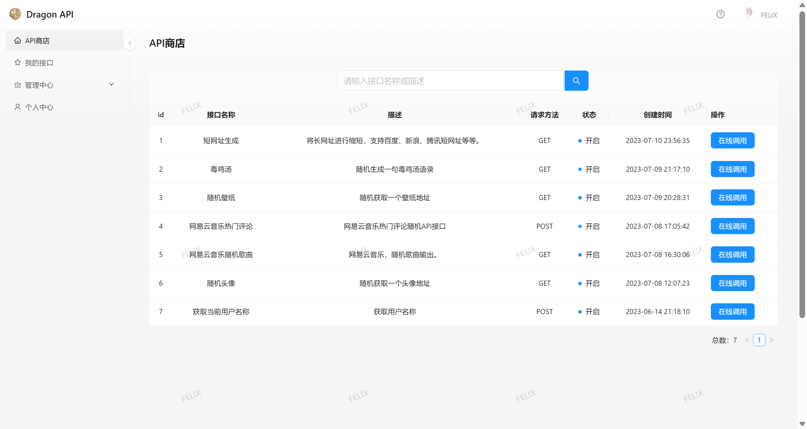
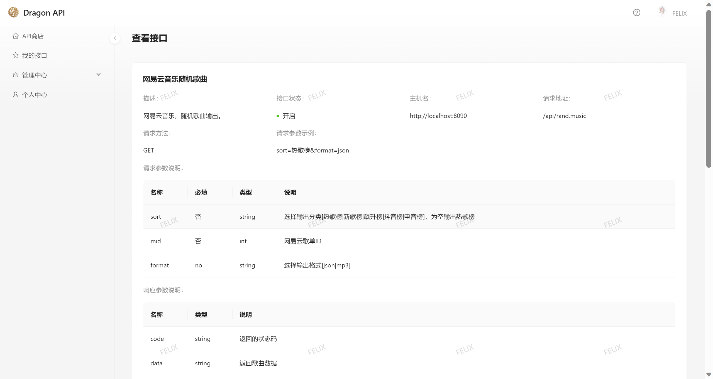
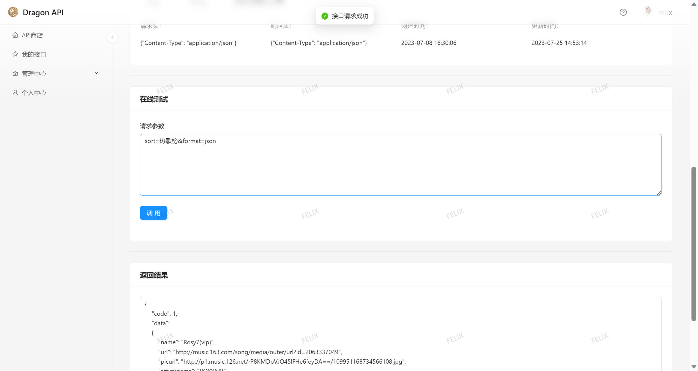
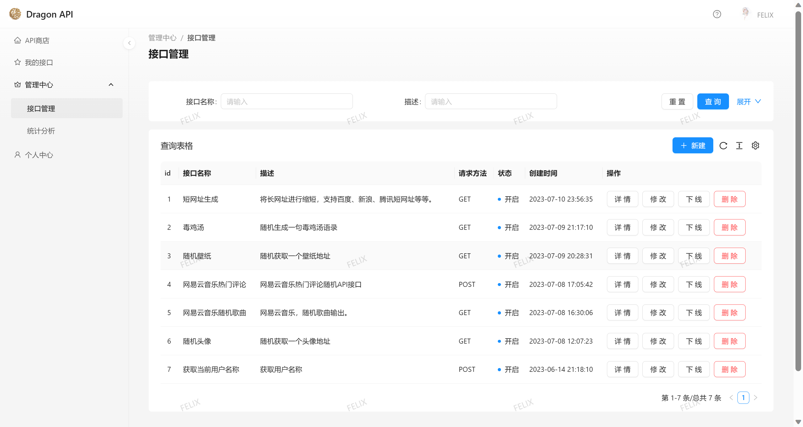
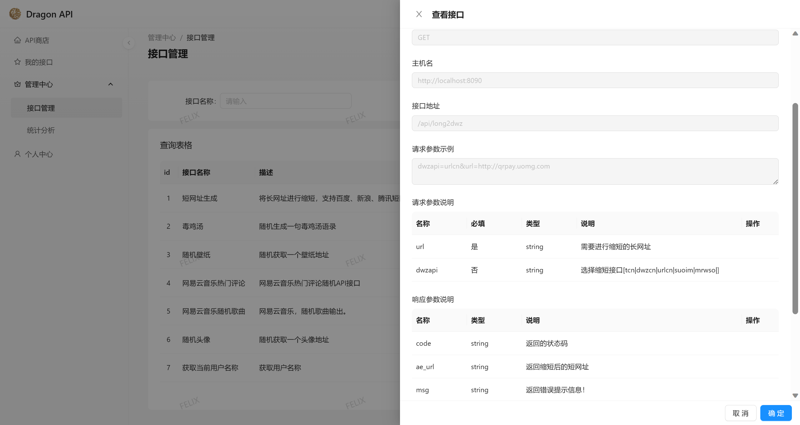
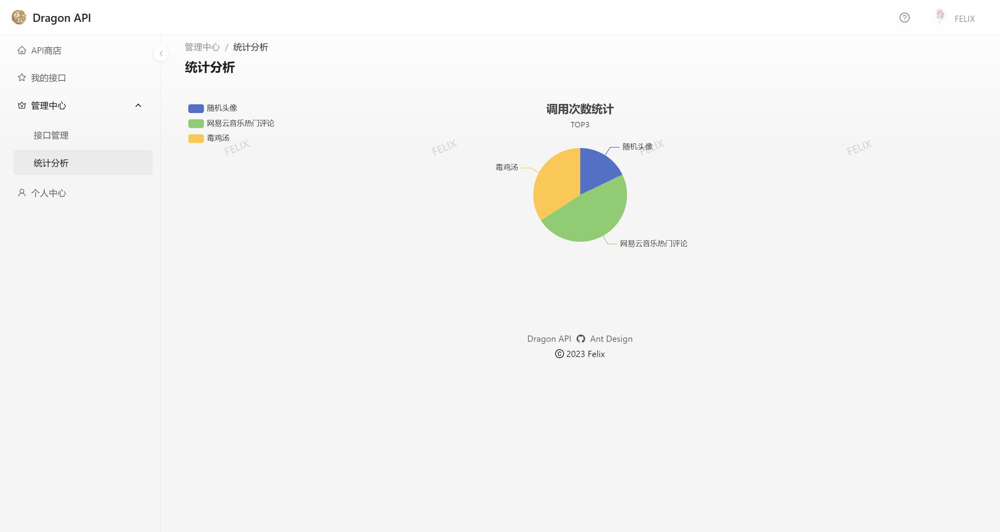
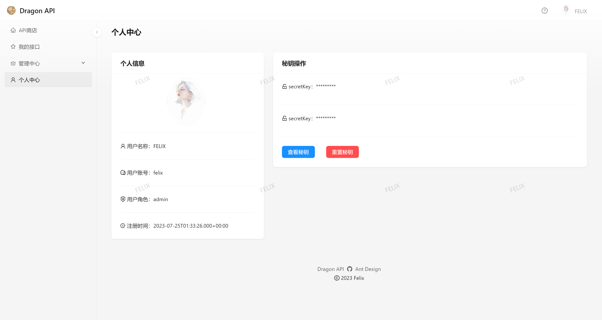

<h1 align="center">Dragon API</h1>
<div align="center">
史上最好用的免费API接口平台<br>
    （点击封面即可跳转）
</div>
<p align="center">
  <a target="_blank" href="http://123.60.212.37/profile">
    
  </a>
</p>


## 🌈 功能展示

- 接口商店



- 个人接口


- 接口调用





- 接口管理





- 接口数据统计分析



- 个人主页




## ⌨️ 技术选型

#### 前端

- React 18
- Ant Design Pro 脚手架
- Ant Design & Procomponents 组件库
- Umi 4 前端框架
- OpenAPI 前端代码生成

#### 后端

- Java Spring Boot
- MySQL 数据库
- MyBatis-Plus 及 MyBatis X 自动生成
- API 签名认证
- Redis（Redisson 分布式锁）
- Spring Boot Starter（SDK 开发）
- Dubbo 分布式（RPC、Nacos）
- Swagger + Knife4j 接口文档生成
- Spring Cloud Gateway 微服务网关
- Hutool、Apache Common Utils、Gson 等工具库


## ✨ 特性

- 根据业务流程，将整个项目后端划分为 web 系统、模拟接口、公共模块、客户端 SDK、API 网关这 5 个子项目，并使用 Maven 进行**多模块依赖管理**和打包
- 为防止接口被恶意调用，设计 **API 签名认证算法**，为用户分配唯一 ak / sk 以鉴权，保障调用的安全性、可溯源性
- 为解决开发者调用成本过高的问题，基于 Spring Boot Starter 开发了**客户端 SDK**，一行代码 即可调用接口，提高开发体验
- 选用 Spring Cloud Gateway 作为 **API 网关**，实现了路由转发、访问控制、流量染色，并集中处理签名校验、请求参数校验、接口调用统计等业务逻辑，提高安全性的同时、便于系统开发维护
- 自定义 Spring Cloud gateway 错误处理Handler，并统一 API 网关异常处理，提高了系统的可维护性和用户体验性。
- 为解决多个子系统内代码大量重复的问题，抽象模型层和业务层代码为公共模块，并使用 Dubbo RPC 框架实现子系统间的**高性能接口调用**，大幅减少重复代码


## 📦后端模块介绍

- api-admin：后端服务，提供接口调用、接口管理、用户管理等基本操作
- api-common：项目公共模块，包含一些公用的实体类，远程调用接口
- api-gateway：api网关，整个后端的入口，作服务转发、用户鉴权、统一日志、服务接口调用计数等
- api-interface：平台提供的接口服务，目前只有简单的几个接口，大家可以自行拓展
- api-client-sdk：提供给开发者的SDK


## 🔨  项目启动

#### 🛡前端：

初始化：

使用 pro-cli 快速的初始化脚手架

```bash
# 使用 npm
npm i @ant-design/pro-cli -g
pro create myapp
```

选择 umi 的版本

```shell
? 🐂 使用 umi@4 还是 umi@3 ? (Use arrow keys)
❯ umi@4
  umi@3
```

> 如果选择了 umi@4 版本，暂时还不支持全量区块。

如果选择了 umi@3，还可以选择 pro 的模板，pro 是基础模板，只提供了框架运行的基本内容，complete 包含所有区块，不太适合当基础模板来进行二次开发

```shell
? 🚀 要全量的还是一个简单的脚手架? (Use arrow keys)
❯ simple
  complete
```

安装依赖：

```shell
$ cd myapp && tyarn
// 或
$ cd myapp && npm install
```

修改 requestConfig 中的 baseURL 为本地地址，运行项目：

```shell
npm run dev
```

详情请参考 [Ant Design Pro 官网开发文档](https://pro.ant.design/zh-CN/docs/getting-started/)


---


#### ⚙️后端：

配置本地mysql、redis、nacos、dubbo后，使用maven工具对api-common模块和api-client-sdk模块进行install，然后依次运行api-interface、api-admin和api-gateway模块。

💡 部分敏感信息已脱敏处理，需自行配置后才能运行